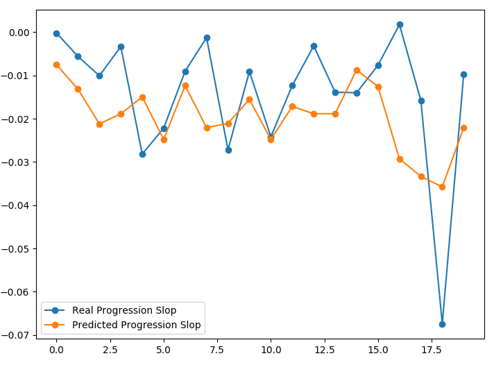
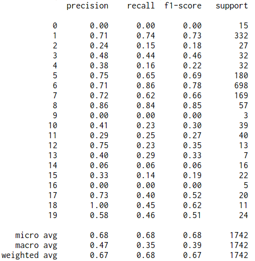

# PLM data challenge

> Prediction results on test data can be visualized here: [web app](http://dataengineermz.club/)

## Table of Contents

1. [Summary](README.md#Summary)
1. [Methods and Results](README.md#Methods-and-Results)
1. [Instruction](README.md#Instruction)
1. [If I had more time](README.md#If-I-had-more-time)
1. [Contact Information](README.md#contact-information)

***

## Summary

For this data challenge, I tried to answer the following 2 questions:
1. Can the deterioration speed be predicted based on the user's existing conditions?
2. Can the medical conditions be predicted based on the user's reported symptoms?

Ideally, I would want to link those questions together. However, in the data I was given, there are only 16 common user_ids between user_ALSFRS_score data and user_symptom data, too few to train models that can reliably link those two. I chose the above 2 questions instead.

For both questions, I separated user ids into training ids and testing ids. All models were developed using data associated with training user ids only(177 users for question 1, 29458 users for question 2). The model will only see the data from testing id when using the Web app.

---
## Methods and Results

For question 1, where I want to predict deterioration speed based on user's existing condition. I defined the deterioration speed as the slope of the linear fit of an individual user's ALSFRS score. I built a general linear model (GLM) using user conditions to build the regression matrix: 20 unique conditions, each condition as a column of 0 and 1s, with 1s marking the presence of one condition (177 * 20 matrix). The trained model was used on testing user ids to predict the slope on an individual user base.

For all data from testing user ids, the results is shown below.

For question 2, where I want medical conditions to be predicted based on the user's reported symptoms. There are 6536 unique symptoms in the dataset. Similar method as question 1 was used to build training data set, a matrix consisted of symptom severity score (15591 * 300 matrix) was used to encode symptoms for each user. I only picked the top 300 most common symptoms to train a Decision Tree Classifier with 250 tree stumps caped at 175 deepth trained in sequence. This classifier was trained on users with only 1 condition, and can only predict 1 condition even though test user may have multiple conditions

When tested on data associated with testing user ids, the accuracy is 68%. The detailed results are shown below.

---
## Instruction
Figure 1:
To predict progression speed, select the user Id from the drop down bar. Those user ids are from test user ids. It will load data from the user_condition table to predict progression slope.

Figure 2:
To predict user condition, select the user Id from the drop down bar. Those user ids are from test user ids. It will load data from user_symptom table to predict user's conditions

All my scripts are in the scripts folder.
1. das_app.py is the web app script, it also has the model implementation.
2. fishing_trip.py is the data exploration and model training script, trained modeled saved to trained_models folder.
3. fun.py has the helper functions.
4. training_testing_ids folder has the pre-separated training and testing ids.

---
## If I had more time
I spent Wednesday and Thursday on the data challenge. Here are the areas, I think I could improve:
1. More complicated model to predict progression slop, taking into symptom information if possible
2. To predict multiple conditions instead of only one for individual user.

---
## Contact Information

* [LinkedIn](https://www.linkedin.com/in/zm6148)
* mz86@njit.edu
